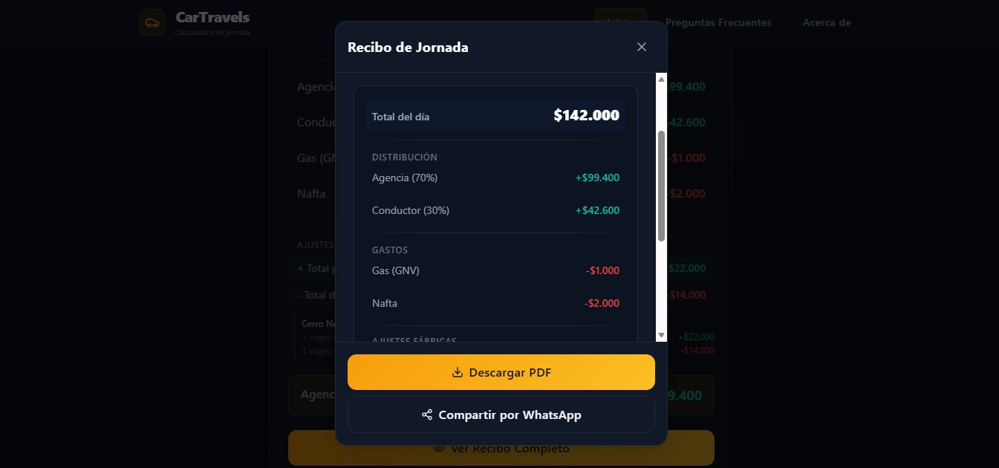
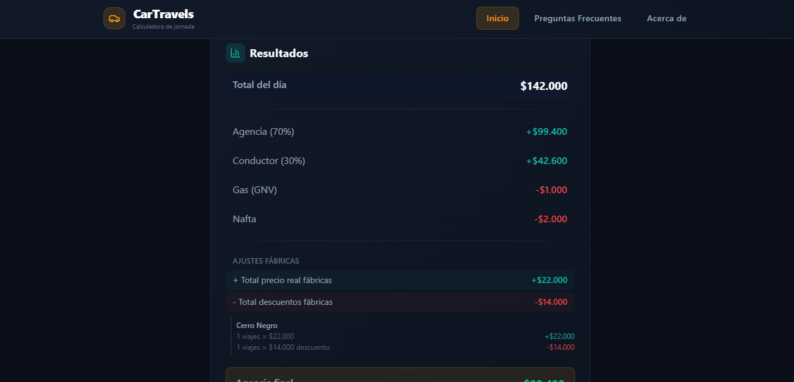
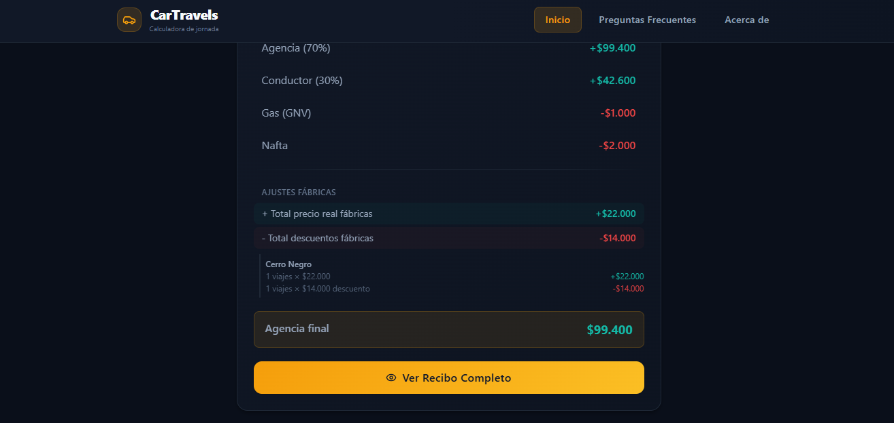
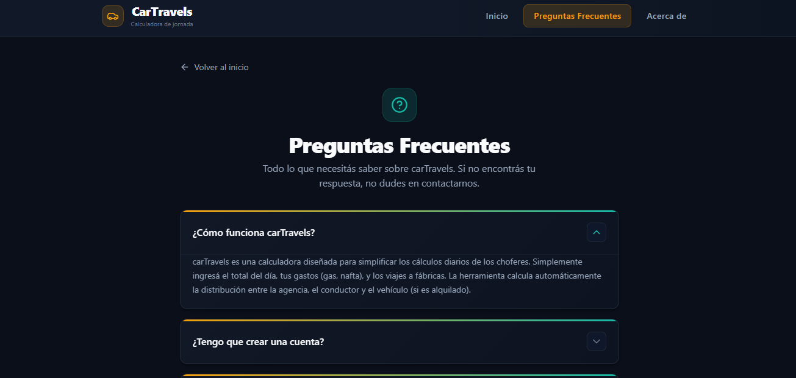
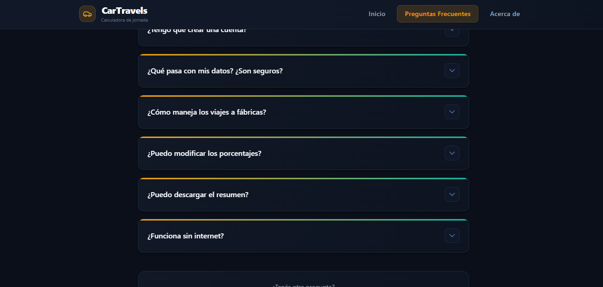
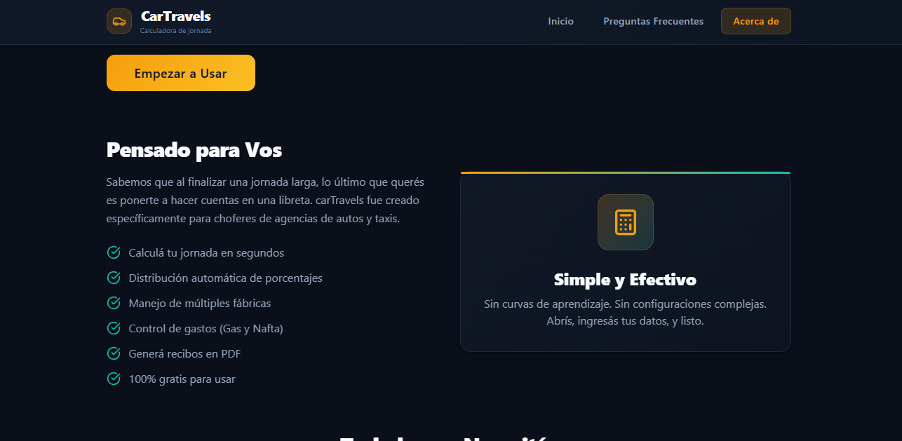

# CarTravels

Calculadora de jornada diseñada para choferes de agencias de autos y taxis. Simplifica tus cálculos diarios.

---

## Tabla de Contenidos

- [Objetivo](#objetivo)
- [Comandos Rápidos](#comandos-rápidos)
- [Stack Tecnológico](#stack-tecnológico)
- [Librerías Principales](#librerías-principales)
- [Estructura de Archivos](#estructura-de-archivos)
- [Características Principales](#características-principales)
- [Capturas de Pantalla](#capturas-de-pantalla)
- [Despliegue en Vercel](#despliegue-en-vercel)
- [Licencia](#licencia)

---

## Objetivo

`carTravels` resuelve el problema tedioso y propenso a errores que enfrentan los choferes al finalizar su jornada:

- ✅ Ingreso simple de datos (total facturado, gastos de gas/nafta)
- ✅ Cálculos automáticos de porcentajes (agencia, chofer, auto alquilado)
- ✅ Manejo de viajes con vale (fábrica y otros) con precios negociados
- ✅ Validación en tiempo real con mensajes claros (Zod)
- ✅ Generación de comprobante en PDF y compartir por WhatsApp
- ✅ Datos guardados localmente en tu dispositivo (sin registro)
- ✅ Modo claro/oscuro con persistencia de preferencia
- ✅ Secciones colapsables en mobile para navegación paso a paso

---

## Comandos Rápidos

| Acción | Comando |
|--------|---------|
| Instalar dependencias | `pnpm install` |
| Iniciar servidor de desarrollo | `pnpm dev` |
| Build para producción | `pnpm build` |
| Preview del build | `pnpm preview` |
| Lint | `pnpm lint` |

---

## Stack Tecnológico

| Tecnología | Versión | Propósito |
|------------|---------|-----------|
| **React** | 19.2.6 | Librería de UI |
| **TypeScript** | 6.0.2 | Tipado estricto |
| **Vite** | 8.0.12 | Build tool y dev server |
| **Tailwind CSS** | 4.3.0 | Estilos utility-first |
| **React Router** | 7.15.1 | Ruteo SPA |

---

## Librerías Principales

| Librería | Versión | Uso |
|----------|---------|-----|
| `html-to-image` | 1.11.13 | Convertir HTML a imagen (para compartir) |
| `jspdf` | 4.2.1 | Generar PDF del comprobante |
| `lucide-react` | 1.16.0 | Íconos de la UI |
| `react-icons` | 5.6.0 | Íconos de marcas (GitHub, Instagram) |
| `zod` | 4.4.3 | Validación de esquemas con mensajes en español |

---

## Estructura de Archivos

Arquitectura modular siguiendo **Separation of Concerns (SoC)**:

```
src/
├── main.tsx                   # Entry point de React
├── App.tsx                    # Router y configuración principal
├── index.css                  # Tailwind v4 + tema personalizado
│
├── core/                      # LÓGICA CENTRAL (sin dependencia de UI)
│   ├── types/
│   │   └── calculator.ts      # Interfaces: CalculatorState, ValeTrip, Result
│   ├── context/
│   │   ├── CalculatorContext.tsx  # State management + localStorage
│   │   └── ThemeContext.tsx       # Toggle dark/light mode + persistencia
│   ├── schemas/                   # Validación Zod (nuevo)
│   │   ├── calculator.schema.ts  # Schemas de totales y porcentajes
│   │   └── vale.schema.ts        # Schema de vales con z.enum
│   └── hooks/
│       ├── useCalculator.ts   # Lógica pura de cálculos
│       └── useReceiptExport.ts  # Exportar PDF y compartir imagen
│
├── modules/                   # CARACTERÍSTICAS POR DOMINIO
│   ├── calculator/            # Módulo principal de la calculadora
│   │   ├── CalculationContent.tsx  # Orquestador + secciones colapsables
│   │   ├── sections/
│   │   │   ├── ConfigSection.tsx   # Porcentajes + toggle vehículo alquilado
│   │   │   ├── IncomeSection.tsx   # Input del total facturado
│   │   │   ├── ExpensesSection.tsx # Gas (GNV) + Nafta
│   │   │   ├── ValesSection.tsx    # Viajes con vale (fábrica/otro)
│   │   │   └── ResultsSection.tsx  # Desglose de resultados
│   │   └── modals/
│   │       ├── ReceiptModal.tsx    # Vista previa + PDF + compartir
│   │       └── ConfirmResetModal.tsx # Confirmación antes de resetear
│   │
│   ├── layout/                 # Módulo de layout persistente
│   │   ├── Layout.tsx          # Shell: ThemeProvider + Header + Outlet + Footer
│   │   ├── Header.tsx          # Navegación sticky + toggle dark/light
│   │   └── Footer.tsx          # Links legales + redes sociales
│   │
│   └── pages/                  # Módulo de páginas informativas
│       ├── FAQPage.tsx         # Preguntas frecuentes
│       ├── AboutPage.tsx       # Acerca de carTravels
│       ├── TermsPage.tsx       # Términos y condiciones
│       └── PrivacyPage.tsx     # Política de privacidad
│
└── shared/                     # COMPONENTES REUTILIZABLES
    ├── ui/                     # Componentes UI genéricos
    │   ├── Button.tsx          # Botones con variantes
    │   ├── Input.tsx           # Input con label grande, prefijo $, error
    │   ├── PercentageInput.tsx # Input de porcentaje con label mejorado
    │   ├── Toggle.tsx          # Switch toggle accesible
    │   ├── CollapsibleSection.tsx # Sección colapsable responsive (nuevo)
    │   └── Accordion.tsx       # Acordeón para FAQ
    └── components/
        └── LoadingScreen.tsx   # Splash screen animado
```

### Reglas de Arquitectura

| Capa | Puede importar de | No puede importar de |
|------|-------------------|----------------------|
| `core/` | Librerías externas (zod) | `modules/`, `shared/` |
| `core/schemas/` | `zod` | `modules/`, `shared/` |
| `modules/` | `core/`, `shared/` | Otros `modules/*` (solo a través de contratos claros) |
| `shared/` | Librerías externas | `modules/`, `core/` (excepto tipos) |

---

## Archivos de Configuración (Raíz)

```
carTravels/
├── public/
│   ├── favicon.svg
│   ├── robots.txt
│   └── sitemap.xml
│
├── vercel.json               # Config SPA para Vercel (rewrites + headers)
├── vite.config.ts            # Config Vite + React + Tailwind v4
├── tsconfig.json             # Config TypeScript root
├── eslint.config.js          # Config ESLint flat
├── AGENTS.md                 # Especificaciones para agentes AI
├── package.json
├── pnpm-lock.yaml
└── .gitignore
```

---

## Características Principales

### Calculos Automáticos
- **Porcentajes configurables**: Agencia, Chofer, Auto (si es alquilado)
- **Validación en tiempo real**: Los porcentajes deben sumar 100%
- **Ajuste por vales**: Viajes tipo "Fábrica" (con descuento) y "Otro" (sin descuento)
- **Cálculo de agencia final**: Descuentos de vales aplicados automáticamente

### Validación con Zod
- **Mensajes claros en español**: "Máximo 99 viajes", "Completá el total del día"
- **Validación en tiempo real** en cada campo al escribir
- **Límite de 2 dígitos** en el campo "N° Viajes" (máximo 99 viajes realistas)

### Interfaz Adaptable
- **Modo claro/oscuro**: Toggle con ícono Sol/Luna en el header, persistente en localStorage
- **Secciones colapsables en mobile**: Navegación paso a paso (1/5, 2/5...) para evitar scroll excesivo
- **Labels más grandes y visibles**: `text-base font-bold` con color primario, gap reducido al input
- **Inputs con bordes reforzados**: Mayor contraste y área táctil para mejor percepción
- **Textos simplificados**: Mensajes cortos y directos en toda la interfaz

### Persistencia
- Los datos se guardan automáticamente en `localStorage`
- La preferencia de tema (claro/oscuro) también persiste
- No requiere registro ni conexión a internet
- Reset seguro con confirmación

### Exportación
- **Descargar PDF**: Comprobante listo para imprimir o guardar
- **Compartir por WhatsApp**: Convierte el comprobante a imagen y usa Web Share API

### Ruteo SPA
- `/` - Calculadora principal
- `/faq` - Preguntas frecuentes
- `/about` - Acerca de carTravels
- `/terms` - Términos y condiciones
- `/privacy` - Política de privacidad

---

## Capturas de Pantalla

<div align="center">
  
  
  
  
  
  
</div>

---

## Despliegue en Vercel

El proyecto incluye `vercel.json` preconfigurado para SPA:

```json
{
  "rewrites": [{ "source": "/(.*)", "destination": "/index.html" }],
  "headers": [{ "source": "/(.*)", "headers": [{ "key": "X-Content-Type-Options", "value": "nosniff" }] }]
}
```

Esto asegura que:
- Refresh en cualquier ruta funcione (`/faq`, `/about`, etc.)
- Headers de seguridad básicos estén presentes

---

## Licencia

MIT License

Copyright (c) 2026 carTravels

Permission is hereby granted, free of charge, to any person obtaining a copy
of this software and associated documentation files (the "Software"), to deal
in the Software without restriction, including without limitation the rights
to use, copy, modify, merge, publish, distribute, sublicense, and/or sell
copies of the Software, and to permit persons to whom the Software is
furnished to do so, subject to the following conditions:

The above copyright notice and this permission notice shall be included in all
copies or substantial portions of the Software.

THE SOFTWARE IS PROVIDED "AS IS", WITHOUT WARRANTY OF ANY KIND, EXPRESS OR
IMPLIED, INCLUDING BUT NOT LIMITED TO THE WARRANTIES OF MERCHANTABILITY,
FITNESS FOR A PARTICULAR PURPOSE AND NONINFRINGEMENT. IN NO EVENT SHALL THE
AUTHORS OR COPYRIGHT HOLDERS BE LIABLE FOR ANY CLAIM, DAMAGES OR OTHER
LIABILITY, WHETHER IN AN ACTION OF CONTRACT, TORT OR OTHERWISE, ARISING FROM,
OUT OF OR IN CONNECTION WITH THE SOFTWARE OR THE USE OR OTHER DEALINGS IN THE
SOFTWARE.
